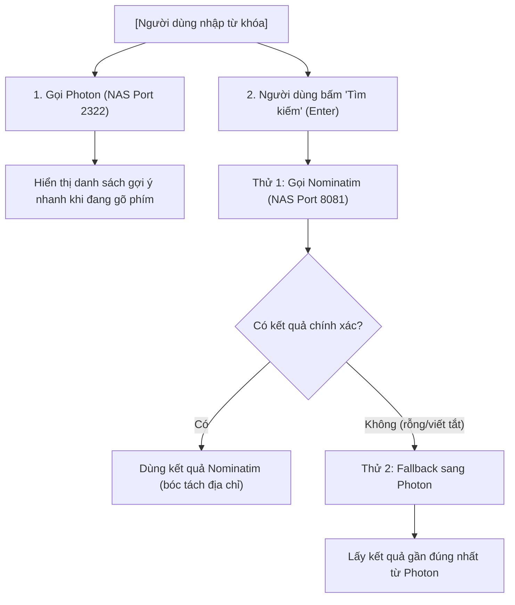

# Master Plan: Hệ Thống Điều Hướng Từ Xa Cho Xe Máy (TYMAP) — Cập Nhật Thực Tế

> **Ngày cập nhật**: 22/08/2026  
> **Trạng thái**: Đã đối soát 100% với Codebase & Hạ tầng thực tế (NAS GraphHopper Host thành công)

---

## 1. So Sánh Hiện Trạng Codebase vs. Master Plan Ban Đầu

Qua đối soát toàn bộ codebase ([`RoutingEngine.kt`](file:///d:/Documents/PlatformIO/Tdriver/TYMAP/app/src/main/java/com/example/tymap/service/RoutingEngine.kt), [`NavigationService.kt`](file:///d:/Documents/PlatformIO/Tdriver/TYMAP/app/src/main/java/com/example/tymap/service/NavigationService.kt), [`main.cpp`](file:///d:/Documents/PlatformIO/Tdriver/TYMAP/firmware/esp32_s3_gc9a01/src/main.cpp), [`gui.cpp`](file:///d:/Documents/PlatformIO/Tdriver/TYMAP/firmware/esp32_s3_gc9a01/src/gui.cpp)):

| Hạng mục | Trong `plan.md` Gemini cũ | Thực tế trong Codebase & Hạ tầng hiện tại | Đánh giá & Hướng điều chỉnh |
|---|---|---|---|
| **Định tuyến (Routing)** | Nêu GraphHopper là Primary trên NAS | Code Android đã hỗ trợ gọi **NAS GraphHopper** (`http://<NAS_IP>:8989`), kèm theo **Multi-Engine Fallback**: GraphHopper Cloud, ORS, OSRM, Valhalla. | **Khởi chạy xuất sắc**. Đã có code kết nối NAS GraphHopper thực tế. Cần chuẩn hóa IP/Domain public NAS và fallback. |
| **Cảnh báo Giao thông & Camera** | Nêu dùng Overpass API trên Docker NAS | App đang dùng Overpass API / Goong.io | **Điều chỉnh theo yêu cầu**: Bỏ qua Goong.io API, sử dụng **Overpass API (Docker NAS)** làm nguồn dữ liệu chính. |
| **Bản đồ nền (Tiles & HUD)** | Render Osmdroid trên Android, nén JPEG gửi BLE | Android vẽ bản đồ ngầm (Headless Map 240x240/480x800), nén JPEG gửi qua BLE (Stream Mode 0/1/2, hỗ trợ cả Google Maps Capture). | **Hoàn thành 90%**. Đã hỗ trợ 7 FPS, CRC32 Frame Skipping, Google Maps VirtualDisplay Capture. |
| **Giao thức BLE** | Chuỗi Byte ngắn dưới 20 bytes | `main.cpp` ESP32 và `BleManager.kt` Android đã triển khai NimBLE: `CHA_MAP_IMAGE` (Stream JPEG map), `CHA_MAP_CTRL` (Gửi Turn-by-Turn & Remote Cmd). | **Đã nâng cấp**. Vừa hỗ trợ ảnh Nền Map vừa hỗ trợ Byte Lệnh HUD/Popup nhấp nháy viền. |
| **Cập nhật OTA** | Chưa mô tả chi tiết | Đã có `UpdateManager.kt` và kế hoạch OTA BLE trong [`implementation_plan.md`](file:///d:/Documents/PlatformIO/Tdriver/TYMAP/implementation_plan.md). | Cần bổ sung OTA Partition (`min_spiffs.csv`) trên ESP32 để kích hoạt. |

---

## 2. Ma Trận Dịch Vụ Lõi (Updated Primary & Fallback Strategy)

| Phân hệ chức năng | Dịch vụ trên NAS (Primary) | API Công cộng / Chạy tại App (Fallback) | Ghi chú Kỹ thuật |
|---|---|---|---|
| **Định tuyến (Routing)** | **GraphHopper (Docker NAS - Port 8989)** | GraphHopper Cloud / OpenRouteService (ORS) / OSRM | Profile: `scooter`/`motorcycle`. Hỗ trợ custom weighting né phà, né trạm thu phí (`avoidTolls`, `avoidFerries`). |
| **Gợi ý Tìm kiếm (Autocomplete)** | **Photon (Docker NAS - Port 2322)** | Photon Public (Komoot) | Gõ tiếng Việt không dấu, gợi ý tức thì khi đang gõ phím. |
| **Tìm / Ghim Tọa độ (Geocoding)** | **Nominatim (Docker NAS - Port 8081)** | Nominatim Public (OSM) | Đã đổi sang Port **8081** (tránh đụng Port 8080 đang dùng cho File Browser NAS). |
| **Cảnh báo Camera & Tốc độ** | **Overpass API (Docker NAS - Port 8088)** | Overpass Public API | Quét tọa độ biển báo / camera phạt nguội dọc theo tuyến đường Polyline. |
| **Bản đồ ngầm & Render BLE** | Render nội bộ trên Android (`NavigationService`) | CartoDB Positron / Google Maps Capture | Tối ưu nén JPEG 240x240 512B MTU gửi BLE cho ESP32. |

---

## 3. Luồng Xử Lý Tìm Kiếm & Geocoding



---

## 4. Kiến Trúc Mạng & Kết Nối NAS (Production Ready)

```
[ ESP32 HUD ] <--- BLE (JPEG Tile / Binary Cmd) ---> [ Android App (Edge Brain) ]
                                                            │
                                        ┌───────────────────┴───────────────────┐
                                        ▼                                       ▼
                             [ Tailscale Virtual IP ]                 [ Cloudflare Tunnel / NPM ]
                             (Dành cho Dev / Nội bộ)                   (Dành cho Production / User)
                                        │                                       │
                                        └───────────────────┬───────────────────┘
                                                            ▼
                                                    [ NAS Docker Stack ]
                                            ├── GraphHopper (Port 8989)
                                            ├── Photon Search (Port 2322)
                                            ├── Nominatim (Port 8081)
                                            └── Overpass API (Port 8088)
```

---

## 5. Lộ Trình Triển Khai Thực Tế (Master Roadmap)

### 📌 Giai đoạn 1: Chuẩn hóa & Kết nối NAS Backend (GraphHopper, Search & Overpass)
- [x] Host thành công GraphHopper trên NAS (Port 8989).
- [ ] Cấu hình URL NAS linh hoạt trong Android Settings (thay vì fix cứng `192.168.1.114`): hỗ trợ cả IP Nội bộ, IP Tailscale và Domain Cloudflare.
- [ ] Kiểm tra nạp file `vietnam-latest.osm.pbf` trên GraphHopper NAS với profile `motorcycle/scooter`.
- [ ] Khởi chạy Docker Container cho **Photon** (`2322`), **Nominatim** (`8081`) và **Overpass API** (`8088`).
- [ ] Tích hợp toàn bộ các dịch vụ trên vào **Web Dashboard Quản lý NAS (Port 8085)** (`/home/nas152/graphhopper-data/index.html`) để theo dõi trạng thái Health Status & Test API trực tiếp trên UI.

### 📌 Giai đoạn 2: Tối ưu Android App (Logic Search Cascading & Overpass Warning)
- [x] Tích hợp Multi-Engine Routing (GraphHopper, ORS, OSRM, Valhalla) với tự động chọn route ngắn nhất.
- [ ] Cập nhật luồng Search: Photon cho autocomplete gõ phím -> Nominatim khi bấm Enter (fallback Photon nếu rỗng).
- [ ] Thay thế Goong.io sang Overpass API để quét camera & biển báo tốc độ dọc tuyến đường Polyline.
- [ ] Bóc tách link Google Maps Share thông minh (redirect HTML 200 OK & parse `/dir/`).
- [ ] Hoàn thiện cơ chế tự động chuyển đổi sang GraphHopper Cloud / ORS khi NAS Timeout (3 giây).

### 📌 Giai đoạn 3: Tối ưu Luồng Truyền BLE & Giao Diện ESP32 HUD
- [x] Stream ảnh bản đồ ngầm JPEG 7 FPS + CRC32 Frame Skipping.
- [x] VirtualDisplay Screen Capture cho Google Maps (Android 14+ compatible).
- [x] Hiển thị HUD ngã rẽ, cảnh báo tốc độ nhấp nháy viền đỏ trên GC9A01 (`gui.cpp`).
- [ ] Tối ưu hóa chuyển đổi smooth giữa HUD Mode và Map Mode khi có biến động GPS.

### 📌 Giai đoạn 4: Hoàn Thiện Hạ Tầng OTA & Phân Phối
- [ ] Đổi partition ESP32 sang `min_spiffs.csv` trong `platformio.ini` để sẵn sàng cho OTA Firmware.
- [ ] Bổ sung handler nhận binary OTA qua BLE trên `main.cpp`.
- [ ] Cấu hình `version.json` và GitHub Releases để cập nhật tự động cho cả APK và Firmware.

---

## 6. Kế Hoạch Kiểm Thử & Xác Minh (Verification)
1. **Kiểm thử Tìm kiếm (Search Flow)**: Gõ từ khóa kiểm tra gợi ý nhanh từ Photon; bấm Enter kiểm tra Nominatim bóc tách địa chỉ chính xác và fallback Photon khi nhập chuỗi viết tắt/không dấu.
2. **Kiểm thử Camera Overpass**: Gửi tuyến đường chạy thử và kiểm tra Overpass API trả về danh sách tọa độ camera/biển báo dọc tuyến.
3. **Kiểm thử Failover NAS**: Ngắt kết nối NAS kiểm tra App tự động fallback sang Nominatim/Photon Public & ORS Routing.

