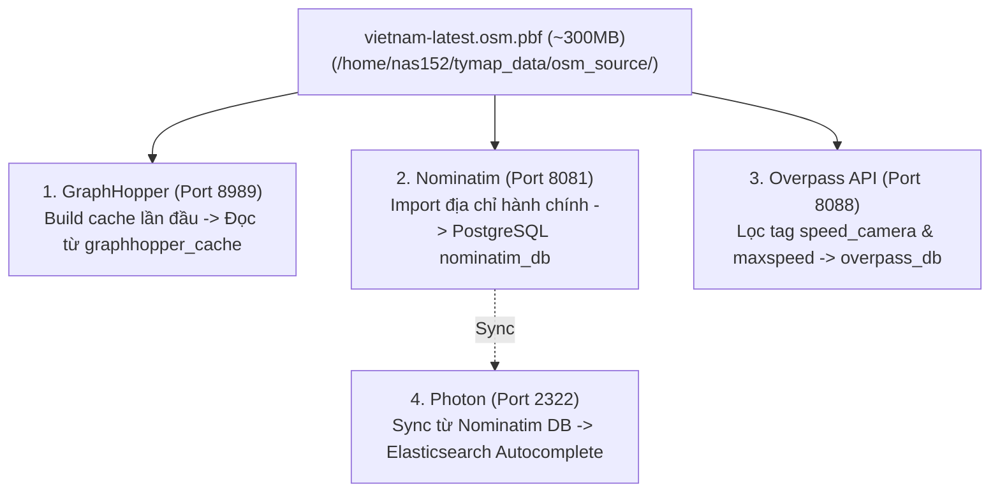

# MASTER PLAN (PHẦN 2): QUẢN LÝ DỮ LIỆU LÕI & NGUỒN TÀI NGUYÊN (TYMAP)

> **Cập nhật thực tế cho Máy chủ NAS (`nas152` - 192.168.1.114)**  
> **Trạng thái**: Đã chuẩn hóa đường dẫn dữ liệu `/home/nas152/tymap_data` và các port dịch vụ thực tế.

---

## 1. Nguồn Dữ Liệu Gốc (Single Source of Truth)

Toàn bộ hệ thống tự host (GraphHopper, Nominatim, Overpass, Photon) được vận hành xoay quanh **1 nguồn dữ liệu gốc duy nhất**. Điều này giúp tối ưu hóa dung lượng ổ cứng trên NAS và đảm bảo mọi dịch vụ (chỉ đường, tìm kiếm, cảnh báo) luôn đồng bộ dữ liệu địa lý với nhau.

Nguồn cung cấp chính thức và ổn định nhất cho dự án là máy chủ của **Geofabrik** (đối tác của OpenStreetMap).

### Danh sách Link tải trực tiếp (Direct Links)

| Loại File | Chức năng | Dung lượng | Link Tải Trực Tiếp (Cập nhật hàng ngày) |
| :--- | :--- | :--- | :--- |
| **Bản đồ PBF (Gốc)** | Dùng cho Nominatim, Overpass, GraphHopper | ~300 MB | [vietnam-latest.osm.pbf](https://download.geofabrik.de/asia/vietnam-latest.osm.pbf) |
| **MD5 Checksum** | Kiểm tra file PBF có bị lỗi khi tải không | < 1 KB | [vietnam-latest.osm.pbf.md5](https://download.geofabrik.de/asia/vietnam-latest.osm.pbf.md5) |
| **Thư mục Updates** | Dành cho Nominatim/Overpass tự động cập nhật | N/A | [Vietnam Updates (Replication)](https://download.geofabrik.de/asia/vietnam-updates/) |
| **Vector Tiles (.mbtiles)** | Dùng riêng cho TileServer GL (Tùy chọn render) | ~500 MB | [Maptiler Data Vietnam](https://data.maptiler.com/downloads/dataset/osm/asia/vietnam/) |

---

## 2. Sơ Đồ Cấu Trúc Thư Mục Trên NAS (`nas152`)

Cấu trúc thư mục Master Data tập trung tại `/home/nas152/tymap_data` để các container Docker mount chung:

```text
/home/nas152/tymap_data/
 ├── osm_source/
 │    └── vietnam-latest.osm.pbf     <-- File gốc đặt ở đây (GraphHopper, Nominatim, Overpass đọc chung)
 ├── graphhopper_cache/              <-- Cache ma trận đường đi của GraphHopper
 ├── nominatim_db/                   <-- Cơ sở dữ liệu PostgreSQL của Nominatim
 ├── overpass_db/                    <-- Cơ sở dữ liệu cảnh báo tốc độ/camera của Overpass
 └── tileserver_data/
      └── vietnam.mbtiles            <-- File dùng cho máy chủ hình ảnh (tùy chọn)
```

---

## 3. Cơ Chế Tiêu Thụ Dữ Liệu Của Từng Dịch Vụ



### A. Nhóm đọc trực tiếp từ file `.pbf`
1. **GraphHopper (Port 8989):** Đọc `vietnam-latest.osm.pbf` ở lần chạy đầu tiên, phân tích các node giao cắt, loại bỏ đường cao tốc dựa trên profile `motorcycle/scooter` trong `config-loc.yml`, sau đó lưu vào bộ nhớ đệm tại `graphhopper_cache`. Các lần khởi động sau sẽ tải trực tiếp từ cache trong vài giây.
2. **Nominatim (Port 8081):** Đọc file `.pbf`, bóc tách toàn bộ thông tin hành chính (Số nhà, Đường, Phường, Xã) và nạp vào cơ sở dữ liệu PostgreSQL (`nominatim_db`). Sau khi nạp xong (mất khoảng 30–45 phút), nó chỉ truy vấn trực tiếp từ PostgreSQL. *(Lưu ý: Port đã đổi thành 8081 để tránh trùng FileBrowser 8080).*
3. **Overpass API (Port 8088):** Quét qua file `.pbf`, lập chỉ mục các node chứa tag `highway=speed_camera` và `maxspeed=*`. Dữ liệu được nén lại vào thư mục `overpass_db`.

### B. Nhóm tiêu thụ dữ liệu phái sinh
4. **Photon (Port 2322 - Gợi ý tìm kiếm mờ):** Sau khi Nominatim build xong PostgreSQL, Photon sẽ trích xuất dữ liệu từ Nominatim sang Elasticsearch để phục vụ tính năng Autocomplete siêu tốc khi người dùng gõ phím.
5. **TileServer GL:** Đọc file `vietnam.mbtiles` để render Vector/Raster Tiles (nếu có nhu cầu host tile server riêng).

---

## 3. Tệp Dữ Liệu Cảnh Báo Giao Thông Bổ Sung (Custom CSV / GeoJSON)

> **Thực tế tại Việt Nam**: Dữ liệu về tốc độ giới hạn (`maxspeed`) và camera phạt nguội trên OpenStreetMap tuy có nhưng chưa bao phủ 100%, đặc biệt là ở các tuyến quốc lộ mới, tỉnh lộ và khu vực ngoại thành.

### A. Danh sách tệp dữ liệu cộng đồng:
- **`camera_phat_nguoi_vn.csv`**: Danh sách tọa độ GPS, loại camera (phạt tốc độ, vượt đèn đỏ, lấn làn), hướng giám sát và mô tả vị trí.
- **`bien_bao_toc_do.geojson`**: Các đoạn đường kèm giới hạn tốc độ xe máy (40km/h, 50km/h, 60km/h, 70km/h...).

```text
/home/nas152/tymap_data/
 ├── custom_alerts/
 │    ├── camera_phat_nguoi_vn.csv   <-- Tệp CSV camera phạt nguội cập nhật từ cộng đồng
 │    └── bien_bao_toc_do.geojson    <-- Tệp GeoJSON biển báo tốc độ bổ sung
```

### B. Cơ chế phân phối & Tích hợp:
1. **Lưu trữ & Phân phối trên NAS**: Đặt trong `/home/nas152/tymap_data/custom_alerts/` và được Web Dashboard / API Server NAS (`http://192.168.1.114:8085/alerts/` hoặc Webhook port `8990`) phân phối trực tiếp.
2. **Đồng bộ về Android App**: Khi app khởi động hoặc có kết nối mạng, app tải bản mới nhất về lưu offline (SQLite / Room DB).
3. **Hợp nhất (Merge Engine)**: App Android tự động gộp:
   $$\text{Mảng Cảnh Báo Tổng Hợp} = \text{Overpass API (Live OSM)} \cup \text{Custom CSV/GeoJSON (Offline)}$$
4. **Truyền xuống ESP32**: Đẩy cảnh báo qua BLE (nhấp nháy viền đỏ GC9A01 + còi buzzer + hiển thị tốc độ tối đa) khi xe tiến vào bán kính 300m - 500m trước camera.

---

## 4. Tệp Cấu Hình Định Tuyến Đặc Thù Xe Máy Việt Nam (`vietnam_motorcycle.json`)

GraphHopper có sẵn profile `motorcycle/scooter`, tuy nhiên cần áp dụng Custom Model đặc thù cho luật giao thông Việt Nam:

### File `vietnam_motorcycle.json` (GraphHopper Custom Model):
```json
{
  "priority": [
    {
      "if": "road_class == MOTORWAY || road_class == MOTORWAY_LINK",
      "multiply_by": "0"
    },
    {
      "if": "road_class == TRUNK || road_class == PRIMARY || road_class == SECONDARY",
      "multiply_by": "1.0"
    },
    {
      "if": "road_environment == FERRY",
      "multiply_by": "0.9"
    },
    {
      "if": "road_class == RESIDENTIAL || road_class == LIVING_STREET || road_class == SERVICE",
      "multiply_by": "0.8"
    },
    {
      "if": "road_class == TRACK || road_class == BRIDLEWAY",
      "multiply_by": "0.2"
    }
  ],
  "speed": [
    {
      "if": "road_environment == FERRY",
      "limit_to": "15"
    },
    {
      "if": "road_class == LIVING_STREET || road_class == RESIDENTIAL",
      "limit_to": "30"
    },
    {
      "if": "true",
      "limit_to": "60"
    }
  ]
}
```

### Nguyên tắc định tuyến xe máy:
- 🚫 **Trọng số 0 (`multiply_by: 0`)**: Tuyệt đối cấm đi vào đường cao tốc (`highway=motorway`, `motorway_link`).
- 🛵 **Trọng số cao (Ưu tiên đi)**: Các trục đường huyết mạch `trunk`, `primary`, `secondary`.
- ⛴️ **Hỗ trợ qua phà (`route=ferry`)**: Cho phép định tuyến qua các bến phà (đặc biệt quan trọng cho các tour miền Tây sông nước).
- 🏙️ **Đường nội bộ / Hẻm nhỏ**: Cho phép xe máy lưu thông qua các tuyến hẻm dân sinh (`residential`, `living_street`).

---

## 5. File `docker-compose.yml` Chuẩn Hóa Trên NAS

File cấu hình tại `/home/nas152/graphhopper-data/docker-compose.yml`:

```yaml
version: '3.8'

services:
  # 1. Định tuyến xe máy / Scooter (GraphHopper)
  graphhopper:
    image: israelhikingmap/graphhopper:latest
    container_name: tymap_graphhopper
    restart: unless-stopped
    ports:
      - "8989:8989"
    environment:
      - JAVA_OPTS=-Xmx4g -Xms2g
    volumes:
      - /home/nas152/tymap_data/osm_source/vietnam-latest.osm.pbf:/data/vietnam-latest.osm.pbf:ro
      - /home/nas152/tymap_data/graphhopper_cache:/data/vietnam-latest.osm-gh
      - /home/nas152/graphhopper-data/config-loc.yml:/data/config-loc.yml:ro
    command: -i /data/vietnam-latest.osm.pbf -c /data/config-loc.yml
    healthcheck:
      test: ["CMD-SHELL", "curl -f http://localhost:8989/health || exit 1"]
      interval: 10s
      timeout: 5s
      retries: 5
      start_period: 300s

  # 2. Tìm kiếm và Ghim điểm (Nominatim Geocoding)
  nominatim:
    image: mediagis/nominatim:4.4
    container_name: tymap_nominatim
    restart: unless-stopped
    ports:
      - "8081:8080"
    environment:
      - PBF_PATH=/osm/vietnam-latest.osm.pbf
      - REPLICATION_URL=https://download.geofabrik.de/asia/vietnam-updates/
      - NOMINATIM_PASSWORD=tymap_secret_pass
    volumes:
      - /home/nas152/tymap_data/nominatim_db:/var/lib/postgresql/14/main
      - /home/nas152/tymap_data/osm_source:/osm:ro
    shm_size: 2gb

  # 3. Cảnh báo tốc độ & Camera phạt nguội (Overpass API)
  overpass:
    image: wiktorn/overpass-api:latest
    container_name: tymap_overpass
    restart: unless-stopped
    ports:
      - "8088:80"
    environment:
      - OVERPASS_MODE=init
      - OVERPASS_PLANET_URL=file:///osm/vietnam-latest.osm.pbf
      - OVERPASS_META=no
    volumes:
      - /home/nas152/tymap_data/overpass_db:/db
      - /home/nas152/tymap_data/osm_source:/osm:ro
```

---

## 6. Hướng Dẫn Thực Thi Triển Khai (Deployment Guide)

### Bước 1: Kết nối SSH vào NAS
```bash
ssh nas152@192.168.1.114
# Password: 271000
```

### Bước 2: Tải dữ liệu PBF & Khởi tạo thư mục
```bash
chmod +x /home/nas152/graphhopper-data/update_pbf.sh
/home/nas152/graphhopper-data/update_pbf.sh
```

### Bước 3: Khởi chạy toàn bộ Docker Stack
```bash
cd /home/nas152/graphhopper-data
docker compose up -d
```

### Bước 4: Kiểm tra trạng thái hoạt động (Health Check)
```bash
# Kiểm tra danh sách container
docker ps --filter "name=tymap_"

# Kiểm tra log build của từng dịch vụ
docker logs -f tymap_graphhopper
docker logs -f tymap_nominatim
docker logs -f tymap_overpass
```

### Bước 5: Endpoint Kiểm thử API trên NAS
- **GraphHopper Routing**: `http://192.168.1.114:8989/route?point=10.7769,106.7009&point=10.8231,106.6297&profile=scooter`
- **Nominatim Geocoding**: `http://192.168.1.114:8081/search?q=Ben+Thanh&format=json`
- **Overpass API**: `http://192.168.1.114:8088/api/interpreter?data=[out:json];node["highway"="speed_camera"](10.7,106.6,10.9,106.8);out;`
- **Dashboard Trung Tâm**: `http://192.168.1.114:8085/`

