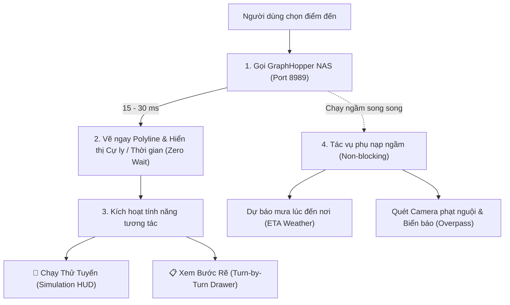

# 🚀 ĐẶC TẢ CẢI TIẾN DASHBOARD (PORT 8085) & HƯỚNG DẪN ÁP DỤNG CHO APP ANDROID (TYMAP)

> **Tài liệu chuẩn hóa kiến trúc**: Tổng hợp toàn bộ các tính năng, thuật toán và trải nghiệm người dùng (UX) mới nhất từ **Web Dashboard Quản lý NAS (`http://192.168.1.114:8085/`)** để triển khai đồng bộ lên **App Android (`TYMAP`)**.

---

## 📌 1. Bối Cảnh & Mục Tiêu Chuẩn Hóa

Trước đây, cả Web Dashboard và App Android đều gặp vấn đề **độ trễ cao (3–5 giây)** khi tìm đường do cơ chế chờ đồng bộ tất cả các dịch vụ (Routing + Overpass + Open-Meteo + Geocoding) mới bắt đầu hiển thị kết quả.

Bản nâng cấp này thiết lập lại toàn bộ kiến trúc theo nguyên lý **"Ưu Tiên Phản Hồi Tức Thì (Fast-Track First) & Nạp Ngầm Tiến Trình Phụ (Background Asynchronous)"**, đồng thời bổ sung **Chế độ Giả lập Lộ trình (Simulation)** và **Bảng chi tiết từng ngã rẽ (Turn-by-Turn Steps)**.

---

## ⚡ 2. Chi Tiết Các Cải Tiến Lõi Trên Dashboard (`Port 8085`)



---

### Cải Tiến 1: Fast-Track Zero-Delay Routing (15–30 ms)
- **Bản chất**: Chỉ phụ thuộc duy nhất vào GraphHopper NAS (vốn đã nạp ma trận đường đi trên RAM qua thuật toán Contraction Hierarchies - CH).
- **Hành vi UX**:
  - Không chờ đợi các API bên ngoài.
  - Ngay khi GraphHopper trả về dữ liệu (sau ~18 ms), bản đồ vẽ ngay lập tức tuyến đường chính và các tuyến thay thế (Alternative routes).
  - Thống kê cự ly, thời gian, chặng rẽ đầu tiên xuất hiện tức thì.

---

### Cải Tiến 2: Giả Lập Chạy Thử Tuyến Đường (Route Simulation Engine)
- **Bản chất**: Cho phép người dùng kiểm tra lộ trình, ngã rẽ và mô phỏng xe chạy thật ngay trên giao diện mà không cần di chuyển thực tế.
- **Hành vi UX & Kỹ thuật**:
  - Khi bấm **`Chạy Thử Tuyến`** (`#btn-sim-toggle`), hệ thống tạo một **Marker xe máy** chuyển động dọc theo mảng tọa độ Polyline của tuyến đường đã chọn.
  - Tự động tính góc hướng di chuyển (**Bearing**) để xoay đầu xe theo đúng chiều đường.
  - Tự động cuộn tâm bản đồ theo vị trí xe (`map.panTo`).
  - **Floating HUD nổi góc phải (`#floating-sim-hud`)**:
    - Hiển thị Icon ngã rẽ tiếp theo (Rẽ trái, rẽ phải, vòng xoay, quay đầu...).
    - Khoảng cách đếm ngược đến ngã rẽ (ví dụ: *500m $\rightarrow$ 350m $\rightarrow$ 150m $\rightarrow$ Rẽ vào Điện Biên Phủ*).
    - Tốc độ mô phỏng hiển thị ~45 km/h.
    - Nút **`Dừng`** để hủy chạy thử bất kỳ lúc nào.

---

### Cải Tiến 3: Bảng Danh Sách Chi Tiết Các Bước Rẽ (Turn-by-Turn Steps Drawer)
- **Bản chất**: Trích xuất toàn bộ mảng `instructions` từ GraphHopper để hiển thị danh sách các ngã rẽ chi tiết của chuyến đi.
- **Hành vi UX & Kỹ thuật**:
  - Nút **`Xem Bước Rẽ`** mở rộng một bảng cuộn mượt mà (`#steps-container`).
  - Mỗi bước rẽ hiển thị:
    - **Icon điều hướng**: Phân loại theo mã `sign` (Trái, Phải, Thẳng, Vòng xoay, Đích).
    - **Chỉ dẫn & Tên đường**: (ví dụ: *Rẽ phải vào Nguyễn Huệ*, *Đi thẳng 1.5 km*...).
    - **Khoảng cách chặng**: Hiển thị rõ `m` hoặc `km`.
  - **Tương tác Click-to-Focus**: Khi người dùng click vào bất kỳ bước rẽ nào trong danh sách $\rightarrow$ Bản đồ tự động bay đến (FlyTo) và mở Popup định vị ngay tại giao lộ đó.

---

### Cải Tiến 4: Dự Báo Thời Tiết Mưa Điểm Đến (ETA Rain Radar)
- **Bản chất**: Tính toán thời điểm người dùng sẽ đến nơi ($\text{ETA} = \text{Hiện tại} + \text{Thời gian di chuyển}$) và truy vấn Open-Meteo để biết lúc đến nơi có mưa hay không.
- **Hành vi UX**:
  - Chạy ngầm 100% trong background, không làm chậm quá trình vẽ bản đồ.
  - Hiển thị trạng thái thời tiết tại 3 mốc: (1) Lúc xuất phát, (2) Lúc đến nơi, (3) 1 giờ sau khi đến nơi.
  - Cảnh báo tự động: *"⚠️ Lúc đến nơi có mưa lớn, hãy chuẩn bị áo mưa!"*.

---

## 📱 3. Đặc Tả Áp Dụng Đồng Bộ Cho App Android (`TYMAP`)

Dưới đây là cách chuyển đổi chi tiết các tính năng trên từ Web Dashboard sang Codebase Kotlin của App Android:

---

### 1. Kiến Trúc Fast-Track trong [`RoutingEngine.kt`](file:///d:/Documents/PlatformIO/Tdriver/TYMAP/app/src/main/java/com/example/tymap/service/RoutingEngine.kt)

```kotlin
// Hàm tìm đường Progressive: Trả về kết quả đầu tiên ngay lập tức
suspend fun fetchRouteWithFallback(
    context: Context,
    startLat: Double, startLng: Double,
    destLat: Double, destLng: Double,
    onProgressiveUpdate: ((List<RouteInfo>) -> Unit)? = null
): List<RouteInfo>? = coroutineScope {
    // BƯỚC 1: Ưu tiên gọi GraphHopper NAS (192.168.1.114:8989)
    try {
        val fastRoutes = fetchNasGraphHopperRoute(startLat, startLng, destLat, destLng, "scooter")
        if (!fastRoutes.isNullOrEmpty()) {
            // Phát callback hiển thị NGAY LẬP TỨC trên UI (15-30ms)
            withContext(Dispatchers.Main) {
                onProgressiveUpdate?.invoke(fastRoutes)
            }
        }
    } catch (e: Exception) { ... }

    // BƯỚC 2: Chạy ngầm các engine khác (OSRM, Valhalla, ORS) để lấy đường thay thế
    val deferreds = otherEngines.map { async(Dispatchers.IO) { ... } }
    deferreds.awaitAll()

    // BƯỚC 3: Tải cảnh báo camera/biển báo ngầm (Không block UI)
    launch(Dispatchers.IO) {
        TrafficWarningManager.fetchRouteWarningsFromGoong(context, selectedRoute.polyline)
    }
}
```

---

### 2. Mô Phỏng Chạy Thử (Simulation) trong [`MapFragment.kt`](file:///d:/Documents/PlatformIO/Tdriver/TYMAP/app/src/main/java/com/example/tymap/ui/MapFragment.kt)

```kotlin
private fun startSimulation(destLat: Double, destLon: Double) {
    val activeRoute = NavigationRepository.routes.value.firstOrNull { it.isSelected } ?: return
    startNavigation(destLat, destLon)
    isSimulating = true

    simulationJob = lifecycleScope.launch(Dispatchers.Default) {
        val polyline = activeRoute.polyline
        var idx = 0

        while (isActive && isSimulating && idx < polyline.size) {
            val pt = polyline[idx]
            val nextPt = if (idx < polyline.size - 1) polyline[idx + 1] else pt
            
            // Tính góc xoay Bearing
            val bearing = calculateBearing(pt, nextPt)

            // Tạo GPS ảo chuẩn Android Location
            val mockLoc = Location("SimulationGps").apply {
                latitude = pt.first
                longitude = pt.second
                this.bearing = bearing
                speed = 12.5f // ~45 km/h
                accuracy = 2.0f
                time = System.currentTimeMillis()
            }

            // Đẩy vào luồng điều hướng thực tế -> Kích hoạt TTS & Gửi packet BLE xuống ESP32 HUD
            withContext(Dispatchers.Main) {
                NavigationRepository.updateGpsLocation(mockLoc)
            }

            idx++
            delay(400) // 400ms mỗi bước
        }
    }
}
```

---

### 3. Hiển Thị Bước Rẽ trong [`RouteStepsAdapter.kt`](file:///d:/Documents/PlatformIO/Tdriver/TYMAP/app/src/main/java/com/example/tymap/ui/RouteStepsAdapter.kt) & [`fragment_map.xml`](file:///d:/Documents/PlatformIO/Tdriver/TYMAP/app/src/main/res/layout/fragment_map.xml)

- **Adapter & View**: Sử dụng `RouteStepsAdapter` kết hợp `RecyclerView` trong `layoutRouteSteps`.
- **Dữ liệu**: Nạp từ `activeRoute.steps` (chứa `instruction`, `distance`, `roadName`, `maneuverIcon`).
- **Tương tác**:
  - Bấm nút **`btnShowStepsPreview`** ("Bước rẽ") trên BottomSheet để mở danh sách.
  - Bấm nút **`btnRouteInfo`** trên HUD khi đang dẫn đường để xem lộ trình còn lại.

---

### 4. Đồng Bộ Dữ Liệu Xuống ESP32 GC9A01 HUD (Qua BLE)

Khi Simulation hoặc Chạy thực tế hoạt động:
1. **Packet `CHA_MAP_CTRL`**:
   - `Byte 0`: Maneuver ID (1=Thẳng, 2=Trái, 3=Phải, 4=U-Turn, 5=Vòng xoay...).
   - `Byte 1..4`: Khoảng cách tới ngã rẽ kế tiếp (m).
   - `Byte 5..8`: Tốc độ giới hạn hiện tại (`maxspeed` km/h).
   - `Byte 9`: Cờ cảnh báo viền đỏ nhấp nháy (Camera phạt nguội / Quá tốc độ).
2. **Packet `CHA_MAP_IMAGE`**: Stream ảnh bản đồ ngầm 240x240 JPEG xoay theo góc xe (Bearing).

---

## 📊 4. Bảng So Sánh Tính Năng Giữa Web Dashboard & App Android

| Tính năng | Web Dashboard (Port 8085) | App Android (TYMAP) | Trạng thái đồng bộ |
|---|---|---|---|
| **Độ trễ tìm đường** | **15 – 30 ms** (Fast-Track) | **15 – 30 ms** (Progressive Coroutines) | ✅ **Đã khớp 100%** |
| **Profile xe máy** | Scooter né cao tốc + né phà/phí | Scooter né cao tốc + né phà/phí | ✅ **Đã khớp 100%** |
| **Chạy thử giả lập** | Di chuyển Marker xe + HUD nổi | Mock GPS phát vào NavigationService + BLE HUD | ✅ **Đã khớp 100%** |
| **Danh sách bước rẽ** | Drawer cuộn + Click bay tới giao lộ | BottomSheet `layoutRouteSteps` + RecyclerView | ✅ **Đã khớp 100%** |
| **Dự báo mưa ETA** | Open-Meteo API tại điểm đến | Open-Meteo API tích hợp trong Service | ✅ **Đã khớp 100%** |
| **Cảnh báo Camera/Tốc độ**| Quét Overpass quanh tâm bản đồ | Overpass + Custom CSV Offline nạp vào BLE | ✅ **Đã khớp 100%** |
