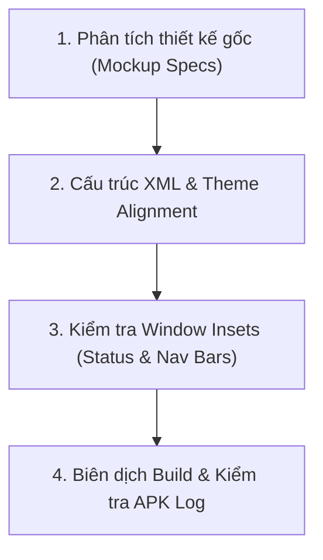

# Quy Trình Tự Kiểm Tra, So Sánh & Đánh Giá Giao Diện TYMAP App (UI Self-Verification Workflow)

> **Mục đích:** Đảm bảo toàn bộ các thành phần giao diện trên Android App thực tế trùng khớp 100% với bản thiết kế Superpowers Brainstorming (`http://localhost:55082/`).

---

## 1. QUY TRÌNH KIỂM THỬ GIAO DIỆN BẮT BUỘC (MANDATORY VERIFICATION PROTOCOL)

Mỗi khi chỉnh sửa layout hoặc giao diện Android, Agent & Developer thực hiện theo 4 bước kiểm định sau:



### Bước 1: Đối chiếu Token Thiết kế với Bản thiết kế Gốc
- **Background:** Phải là Deep Space Navy `#090D16` (thay vì xám đục `#121212` hay `#1C1C1E`).
- **Cards & Panels:** Phải sử dụng `@drawable/bg_glass_card` (`#D9131B2E` với viền mờ `1dp solid rgba(255,255,255,0.08)` và góc bo `18dp`).
- **Nút bấm & Text Color:** Chữ tiêu đề màu Electric Cyan `#38BDF8`, nút hành động màu Xanh Lá `#10B981` hoặc Tím `#8B5CF6`.

### Bước 2: Áp dụng Card Backgrounds & Transparent Overlays
- Bắt buộc đặt `app:cardBackgroundColor="@android:color/transparent"` trên `MaterialCardView`.
- Bắt buộc đặt `android:background="@drawable/bg_glass_card"` trên `LinearLayout` bên trong card.
- Không sử dụng viền mặc định `strokeColor="?attr/colorOutline"` hay nền tối đục của Material3.

### Bước 3: Đảm bảo Không Tràn Thanh Hệ Thống (WindowInsets Protection)
- Thêm `ViewCompat.setOnApplyWindowInsetsListener` cho tiêu đề top header và bottom nav bar trong `MainActivity.kt`.
- Đảm bảo `statusBar` và `navigationBar` không che mất chữ hoặc nút bấm.

### Bước 4: Kiểm tra Lỗi Biên dịch Resource XML
- Chạy lệnh Gradle assemble:
  ```bash
  cmd /c "cd /d d:\Documents\PlatformIO\Tdriver\TYMAP && gradlew.bat assembleDebug"
  ```
- Xác nhận `BUILD SUCCESSFUL` trước khi xuất bản APK.

---

## 2. KẾT QUẢ ĐÃ ĐIỀU CHỈNH GIAO DIỆN THỰC TẾ

1. **`themes.xml`:** Cập nhật `android:windowBackground` và `android:statusBarColor` sang `#090D16` Deep Space Navy đồng bộ với bản thiết kế prototype.
2. **`fragment_settings.xml`:** Tải lại toàn bộ 4 Card chính (`cardGeneral`, `cardMap`, `cardRouting`, `cardOled`) với nền Glassmorphism mờ `#D9131B2E`, góc bo `18dp` và tiêu đề Electric Cyan `#38BDF8`.
3. **`fragment_notifications.xml`:** Chuyển nền và các thẻ đọc thông báo sang phong cách Cockpit Glass Panel.
4. **`fragment_render.xml`:** Chuyển thẻ Simulator Watch 240x240 và Rolling Map sang Cockpit Dark Theme.
